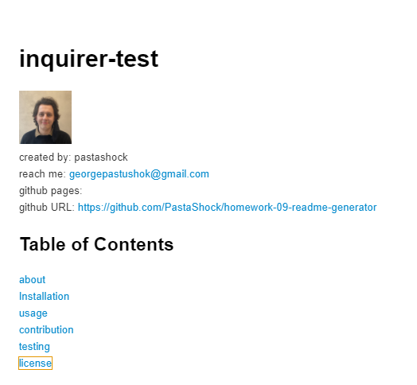

[](http://www.wtfpl.net/about/)
# inquirer-test


created by: pastashock

reach me: georgepastushok@gmail.com

github pages: 

github URL: https://github.com/PastaShock/homework-09-readme-generator


## Table of Contents
- [about](#about)
- [Installation](#Installation)
- [usage](#Usage)
- [contribution](#Contribution)
- [testing](#testing)
- [license](#license)

## About

### A video of the app:
[](https://youtu.be/fqWTwMovJeo)

### Why did I make this project?
This app allows me to create a readme by going through a series of pre-set questions that cover most projects



### What makes this app standout?
This project standsout because it makes use of extensive markdown syntax, clever use of inquirer and licenses

## Installation
```npm i```

## Usage
This project will be run by using 'node index.js' and then answering the following questions

## Contribution
contact me to contribute

## Testing
```jest index.js```

## License
This project is using:
[](http://www.wtfpl.net/about/)

    